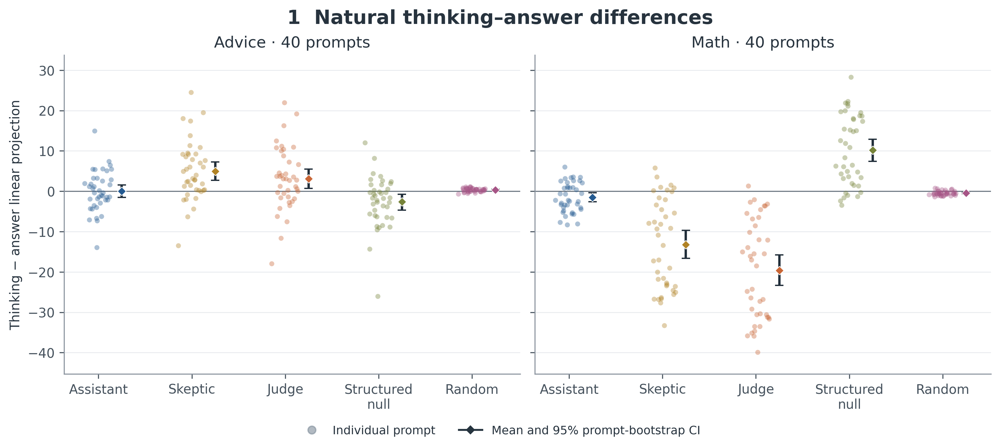
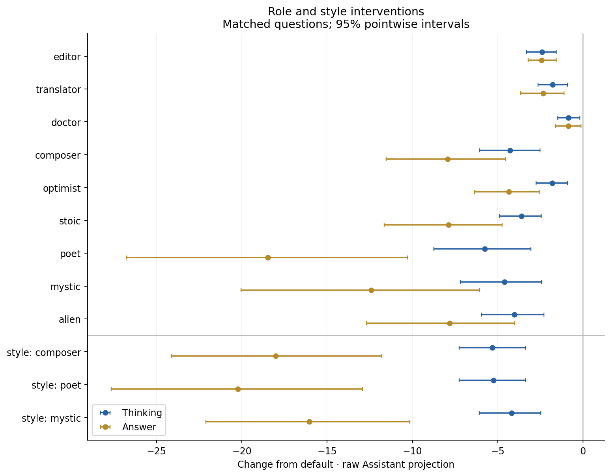
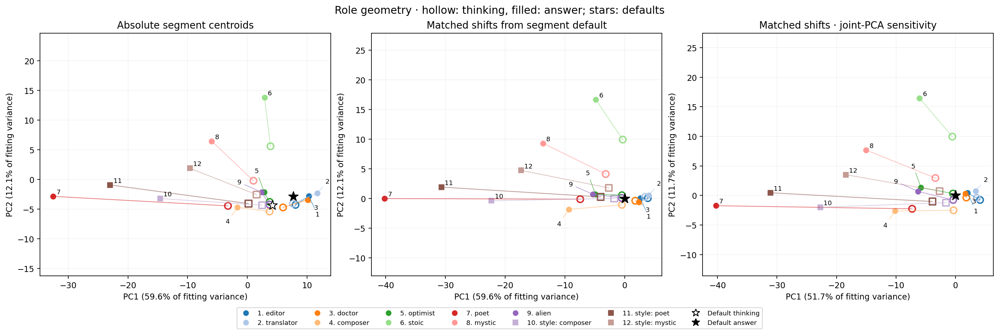

# Thinking Personas

**When a reasoning model starts thinking, is the chain of thought the Assistant thinking, another persona, or no persona at all?**

I experiment with **Qwen3-32B only**, due to computational constraints. Here, “thinking mode” means the text inside the `<think>` block, and “answer mode” means the final response. The published [Assistant Axis](https://github.com/safety-research/assistant-axis/tree/a98961956072224eaf244eb289d6c01700b63795) measures a direction from roleplay toward default assistant responses in activation space.

**There does not seem to be a distinct thinking persona.** Differences between thinking and answer activations depend on the domain and are not specific to the Assistant Axis. Yet when asked to roleplay, the model often shifts thinking representations more weakly than answer representations. This asymmetry may indicate that thinking is treated more as a scratchpad or a separate computational channel.

## Key experiments

### Thinking and answering under default instructions

I record activations per token and project them onto the Assistant Axis, averaging thinking and answer tokens separately within the same response. Skeptic and Judge directions and two null directions serve as controls.

Across **40 retained prompts per domain**, the mean thinking-minus-answer projection is **+0.03 for WildChat advice** (95% CI: −1.53 to +1.59) and **−1.51 for GSM8K math** (−2.63 to −0.37). This provides no evidence of a uniform thinking–answer difference across these domains.



*Each dot is a prompt; diamonds show means and 95% confidence intervals. The larger Skeptic and Judge gaps show that the difference is not specific to the Assistant Axis.*

### Role and style instructions

**Role instructions shift thinking mode less than answer mode in several cases.** I tested nine roles, three style instructions, and default on 12 questions with two seeds: 312 responses. Six of nine roles showed this asymmetry after correction for multiple comparisons.

The pattern also appears with style instructions—asking the model to write in a particular style without changing its AI identity. This preliminary result suggests that the asymmetry extends to stylistic changes.



*Blue shows thinking; gold shows answers. Negative values mean lower Assistant-axis projections than default. The plotted intervals are pointwise 95% intervals; the six-of-nine result uses corrected tests of the difference between the shifts.*

### Persona geometry

**Thinking retains a partly shared structure of roles, but the distinctions are less pronounced.** The spread of the nine role-average vectors is about half as large in thinking as in answers, even after removing the Assistant-axis component.



*Hollow markers show thinking; filled markers show answers. Lines connect the same instruction. The smaller spread is also measured across all activation dimensions, beyond this PCA view.*

## Method and limitations

I generate responses, then replay their exact tokens to measure activations at decoder block 32 (zero-indexed), after its MLP. The headline scores are raw projections onto unit directions, not cosine similarities. Confidence intervals resample prompts or questions, not tokens.

**I use one model, one layer, and small prompt sets.** Advice prompts were screened, and response-length filters affect the sample. I do not establish a causal persona mechanism: the evidence is mainly descriptive. Thinking still responds to instructions; a stable scratchpad is a possible explanation, not an established mechanism. See [methods](docs/METHODS.md) for details.

## Quick start

Requires Python 3.11 or later. This synthetic smoke run checks the software without model weights or a GPU; it does not test the research claims.

```bash
python3 -m venv .venv
source .venv/bin/activate
python -m pip install -e '.[test,analysis]'
persona run --config configs/smoke.yaml
python scripts/verify_run.py runs/smoke
python -m pytest -q
```

See [running the code](docs/RUNNING.md) and [preparing data](docs/DATA.md) for model experiments. The three figures above are included in the repository; datasets, model assets, full saved runs, and other generated figures are kept outside Git.
